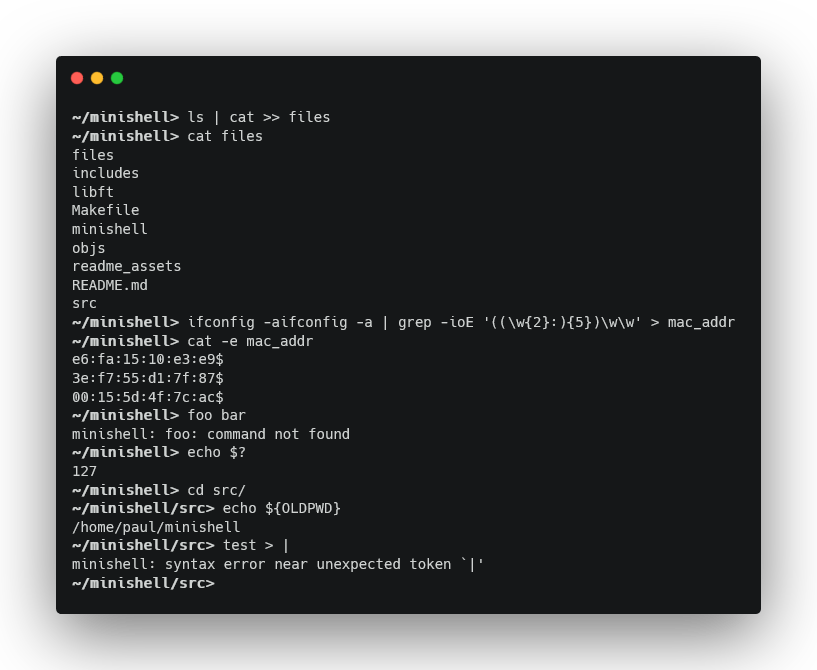

<h1 align="center" style="border-bottom: none; margin-bottom: 0;">
	minishell: By <a href="https://github.com/pbremondFR">pbremond</a> and <a href="https://github.com/Blenderwizard">jrathelo</a>
</h1>

	
	

	

## What is this ?

Minishell is a project in the 42 common core. The goal is to code a shell from scratch, which can handle redirections and piping, across multiple commands chained together. We used bash as a reference whenever we needed to test our shell against a real one.

For this project, we were allowed to use part of the readline library, a huge help when it comes to controlling user input.

With minishell, we learned a lot about interpreting user input (lexer/parser chain), UNIX processes (forking and connecting a process' STDIN/STDOUT), UNIX signals (handling `ctrl+C, D, \`), how a shell behaves internally, and more. An arduous task after only two months of programming experience at the time (three, counting the Piscine), but ultimately an enriching experience.

## Features

Here is a list of some of the features we had to implement:
- Have an input prompt, and command history.
- Have environment variables which can expand to their values when preceeded by a `$`.
- Handle the special `$?` variable, which expands to the exit code of the last command.
- Search and launch a program based on the PATH environment variable.
- Handle double quotes, inhibiting interpretation of their content except for `$`.
- Handle single quotes, inhibiting interpretation of their content at all.
- Handle redirections (`<`, `<<`, `>`, and `>>`) like in bash, for STDOUT.
- Handle pipes (`|`) like in bash, for STDOUT.
- Handle `ctrl+C`, `ctrl+D`, and `ctrl+\` like in bash.

## Builtins
Minishell implements the following built-in commands:
- `echo` with the `-n` flag.
- `cd` with a relative or absolute path.
- `pwd` without flags.
- `export` without flags.
- `unset` without flags.
- `env` without flags or arguments.
- `exit` without flags.

###### P.S: Dear 42 students, I know I have pushed libft.a. It's because I want to keep my libft private but still allow other people to compile and link this project. Rest assured I didn't push the project like this when getting evaluated.
